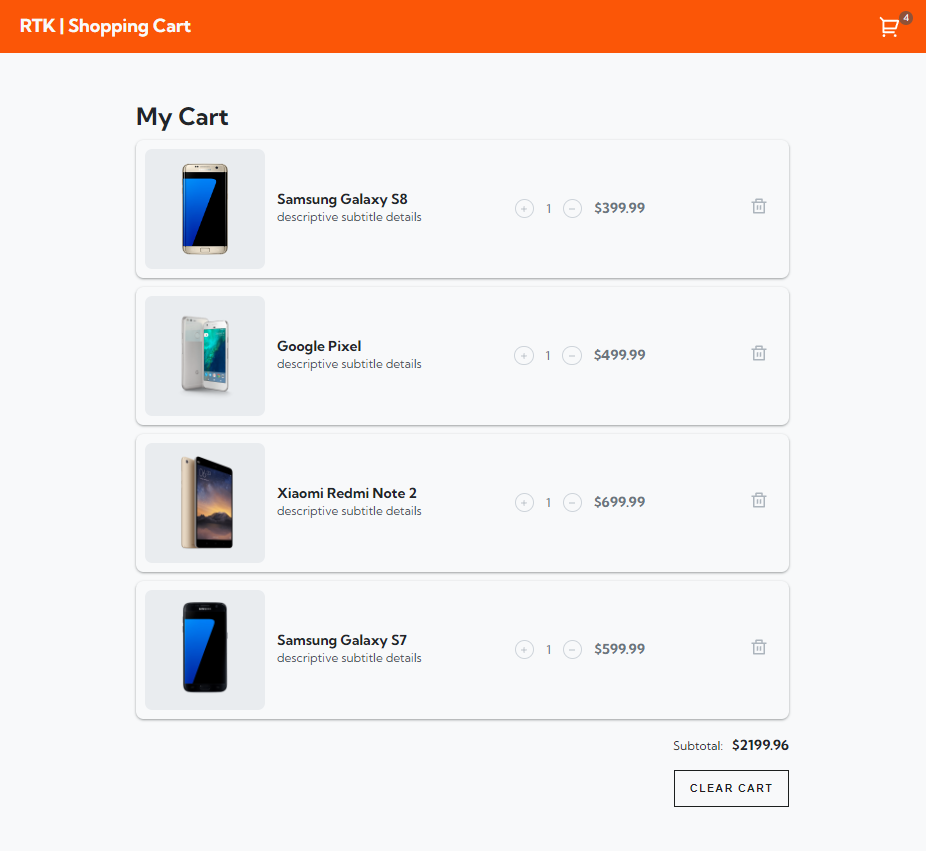

# Redux Toolkit Shopping Cart

This Shopping Cart was created as a study on Redux Toolkit. 

## Tech Stack

   1. Reactjs
   2. Redux Toolkit
   3. Axios

## Scope

   - Header/Navbar featuring a cart icon that displays number of items in cart
   - Order Summary featuring items in the cart, subtotal at the bottom, and a 'clear cart' button
   - Item Cards featuring: 
        * item image
        * product name
        * details
        * increase/decrease quantity selected buttons
        * price
        * delete item from cart button

## Demo

[Demo](https://redux-issue-queue.web.app/ "Shopping Cart Demo")

## Extras

A css class of `.hide` added on the 'continue shopping' button and the 'checkout' button. The functionality of these button are not part of the scope of this study. They will be built out as part of an upcoming study.